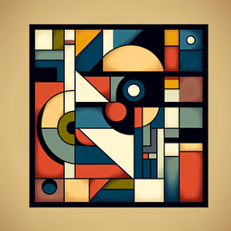

# GPT-Image MCP Server



An MCP (Model Context Protocol) server for generating images using OpenAI's GPT-Image-1 API.

> **Note:** This is a fork of the original [DALL-E MCP Server](https://github.com/Garoth/dalle-mcp) by [Garoth](https://github.com/Garoth), refactored to exclusively support GPT-Image-1 and remove support for DALL-E 2 and DALL-E 3 models.

## Features

- Generate images using GPT-Image-1
- Edit existing images using GPT-Image-1
- Create variations of existing images using GPT-Image-1
- Image-to-image generation with GPT-Image-1
- Multi-image editing with GPT-Image-1
- Validate OpenAI API key

## Installation

```bash
# Clone the repository
git clone https://github.com/Garoth/dalle-mcp.git
cd dalle-mcp

# Install dependencies
npm install

# Build the project
npm run build
```

## Important Note for Cline Users

When using this GPT-Image MCP server with Cline, it's recommended to save generated images in your current workspace directory by setting the `saveDir` parameter to match your current working directory. This ensures Cline can properly locate and display the generated images in your conversation.

Example usage with Cline:
```json
{
  "prompt": "A tropical beach at sunset",
  "saveDir": "/path/to/current/workspace"
}
```


## Usage

### Running the Server

```bash
# Run the server
node build/index.js
```

### Configuration for Cline

Add the GPT-Image server to your Cline MCP settings file inside VSCode's settings (ex. ~/.config/Code/User/globalStorage/saoudrizwan.claude-dev/settings/cline_mcp_settings.json):

```json
{
  "mcpServers": {
    "gpt-image-mcp": {
      "command": "node",
      "args": ["/path/to/gpt-image-mcp-server/build/index.js"],
      "env": {
        "OPENAI_API_KEY": "your-api-key-here",
        "SAVE_DIR": "/path/to/save/directory"
      },
      "disabled": false,
      "autoApprove": []
    }
  }
}
```

Make sure to:
1. Replace `/path/to/gpt-image-mcp-server/build/index.js` with the actual path to the built index.js file
2. Replace `your-api-key-here` with your OpenAI API key

### Available Tools

#### generate_image

Generate an image using GPT-Image-1 based on a text prompt.

```json
{
  "prompt": "A futuristic city with flying cars and neon lights",
  "size": "1024x1024",
  "quality": "high",
  "background": "auto",
  "moderation": "auto",
  "output_format": "png",
  "n": 1,
  "saveDir": "/path/to/save/directory",
  "fileName": "futuristic-city"
}
```

Parameters:
- `prompt` (required): Text description of the desired image
- `size` (optional): Size of the generated image: "1024x1024", "1792x1024", "1024x1792", or "auto" (default: "auto")
- `quality` (optional): Quality of the generated image: "high", "medium", "low", or "auto" (default: "auto")
- `background` (optional): Background transparency: "transparent", "opaque", or "auto" (default: "auto")
- `moderation` (optional): Content moderation level: "low" or "auto" (default: "auto")
- `output_format` (optional): Format of the generated image: "png", "jpeg", or "webp" (default: "png")
- `output_compression` (optional): Compression level (0-100%) for webp/jpeg formats (default: 100)
- `n` (optional): Number of images to generate (1-10, default: 1)
- `saveDir` (optional): Directory to save the generated images (default: current directory or SAVE_DIR from .env). **For Cline users:** Setting this to your current workspace directory is recommended for proper image display.
- `fileName` (optional): Base filename for the generated images without extension (default: "gpt-image-{timestamp}")

#### edit_image

Edit an existing image using GPT-Image-1 based on a text prompt.

```json
{
  "prompt": "Add a red hat",
  "imagePath": "/path/to/image.png",
  "mask": "/path/to/mask.png",
  "size": "1024x1024",
  "quality": "high",
  "background": "auto",
  "moderation": "auto",
  "output_format": "png",
  "output_compression": 100,
  "n": 1,
  "saveDir": "/path/to/save/directory",
  "fileName": "edited-image"
}
```

Parameters:
- `prompt` (required): Text description of the desired edits
- `imagePath` (required): Path to the image to edit
- `mask` (optional): Path to a mask image where the white areas will be edited and black areas will be preserved
- `size` (optional): Size of the generated image: "1024x1024", "1792x1024", "1024x1792", or "auto" (default: "auto")
- `quality` (optional): Quality of the generated image: "high", "medium", "low", or "auto" (default: "auto")
- `background` (optional): Background transparency: "transparent", "opaque", or "auto" (default: "auto")
- `moderation` (optional): Content moderation level: "low" or "auto" (default: "auto")
- `output_format` (optional): Format of the generated image: "png", "jpeg", or "webp" (default: "png")
- `output_compression` (optional): Compression level (0-100%) for webp/jpeg formats (default: 100)
- `n` (optional): Number of images to generate (1-10, default: 1)
- `saveDir` (optional): Directory to save the edited images (default: current directory or SAVE_DIR from .env). **For Cline users:** Setting this to your current workspace directory is recommended for proper image display.
- `fileName` (optional): Base filename for the edited images without extension (default: "gpt-image-edit-{timestamp}")

#### create_variation

Create variations of an existing image using GPT-Image-1.

```json
{
  "imagePath": "/path/to/image.png",
  "size": "1024x1024",
  "n": 4,
  "saveDir": "/path/to/save/directory",
  "fileName": "image-variation"
}
```

Parameters:
- `imagePath` (required): Path to the image to create variations of
- `size` (optional): Size of the generated image: "1024x1024", "1792x1024", "1024x1792", or "auto" (default: "auto")
- `n` (optional): Number of variations to generate (1-10, default: 1)
- `saveDir` (optional): Directory to save the variation images (default: current directory or SAVE_DIR from .env). **For Cline users:** Setting this to your current workspace directory is recommended for proper image display.
- `fileName` (optional): Base filename for the variation images without extension (default: "gpt-image-variation-{timestamp}")

#### image_to_image

Generate an image using an existing image as input with GPT-Image-1.

```json
{
  "imagePath": "/path/to/image.png",
  "prompt": "Transform this into a watercolor painting",
  "size": "1024x1024",
  "quality": "high",
  "background": "auto",
  "moderation": "auto",
  "output_format": "png",
  "output_compression": 100,
  "n": 1,
  "saveDir": "/path/to/save/directory",
  "fileName": "transformed-image"
}
```

Parameters:
- `imagePath` (required): Path to the input image
- `prompt` (required): Text description to guide the generation
- `size` (optional): Size of the generated image: "1024x1024", "1792x1024", "1024x1792", or "auto" (default: "auto")
- `quality` (optional): Quality of the generated image: "high", "medium", "low", or "auto" (default: "auto")
- `background` (optional): Background transparency: "transparent", "opaque", or "auto" (default: "auto")
- `moderation` (optional): Content moderation level: "low" or "auto" (default: "auto")
- `output_format` (optional): Format of the generated image: "png", "jpeg", or "webp" (default: "png")
- `output_compression` (optional): Compression level (0-100%) for webp/jpeg formats (default: 100)
- `n` (optional): Number of images to generate (1-10, default: 1)
- `saveDir` (optional): Directory to save the generated images (default: current directory or SAVE_DIR from .env). **For Cline users:** Setting this to your current workspace directory is recommended for proper image display.
- `fileName` (optional): Base filename for the generated images without extension (default: "gpt-image-{timestamp}")

#### multi_image_edit

Edit multiple images together using GPT-Image-1.

```json
{
  "prompt": "Combine these images into a cohesive scene",
  "imagePaths": ["/path/to/image1.png", "/path/to/image2.png"],
  "size": "1024x1024",
  "quality": "high",
  "background": "auto",
  "moderation": "auto",
  "output_format": "png",
  "output_compression": 100,
  "n": 1,
  "saveDir": "/path/to/save/directory",
  "fileName": "combined-image"
}
```

Parameters:
- `prompt` (required): Text description to guide the generation
- `imagePaths` (required): Array of paths to the input images
- `size` (optional): Size of the generated image: "1024x1024", "1792x1024", "1024x1792", or "auto" (default: "auto")
- `quality` (optional): Quality of the generated image: "high", "medium", "low", or "auto" (default: "auto")
- `background` (optional): Background transparency: "transparent", "opaque", or "auto" (default: "auto")
- `moderation` (optional): Content moderation level: "low" or "auto" (default: "auto")
- `output_format` (optional): Format of the generated image: "png", "jpeg", or "webp" (default: "png")
- `output_compression` (optional): Compression level (0-100%) for webp/jpeg formats (default: 100)
- `n` (optional): Number of images to generate (1-10, default: 1)
- `saveDir` (optional): Directory to save the generated images (default: current directory or SAVE_DIR from .env). **For Cline users:** Setting this to your current workspace directory is recommended for proper image display.
- `fileName` (optional): Base filename for the generated images without extension (default: "gpt-image-{timestamp}")

#### validate_api_key

Validate the OpenAI API key.

```json
{}
```

No parameters required.

## Development

## Testing Configuration

**Note: The following .env configuration is ONLY needed for running tests, not for normal operation.**

If you're developing or running tests for this project, create a `.env` file in the root directory with your OpenAI API key:

```
# Required for TESTS ONLY: OpenAI API Key
OPENAI_API_KEY=your-api-key-here

# Optional: Default save directory for test images
# If not specified, images will be saved to the current directory
# SAVE_DIR=/path/to/save/directory
```

For normal operation with Cline, configure your API key in the MCP settings JSON as described in the "Adding to MCP Settings" section above.

You can get your API key from [OpenAI's API Keys page](https://platform.openai.com/api-keys).

### Running Tests

```bash
# Run basic tests
npm test

# Run all tests including edit and variation tests
npm run test:all

# Run tests in watch mode
npm run test:watch

# Run specific test by name
npm run test:name "should validate API key"
```

Note: Tests use real API calls and may incur charges on your OpenAI account.

### Generating Test Images

The project includes a script to generate test images for development and testing:

```bash
# Generate a test image in the assets directory
npm run generate-test-image
```

This will create a simple test image in the `assets` directory that can be used for testing the edit and variation features.

## License

MIT

## Acknowledgments

This project is a fork of the original [DALL-E MCP Server](https://github.com/Garoth/dalle-mcp) created by [Garoth](https://github.com/Garoth), modified to work exclusively with GPT-Image-1 model.
